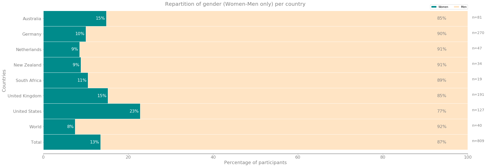
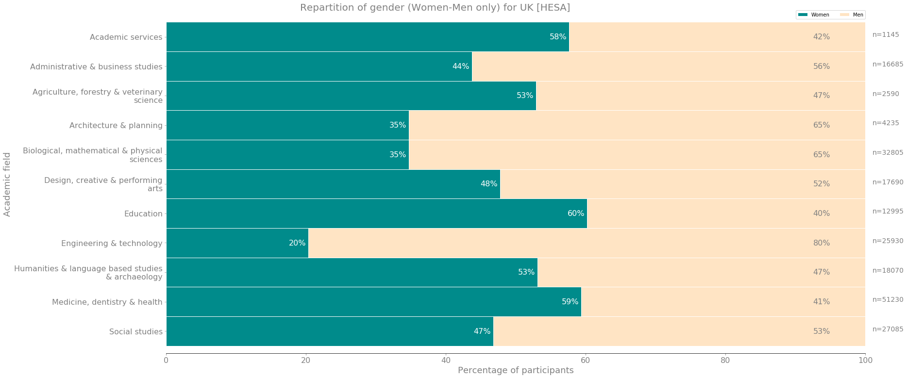
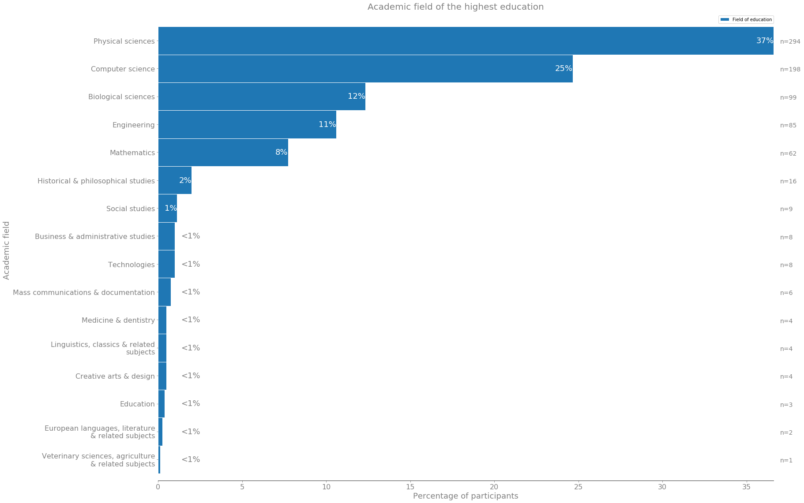
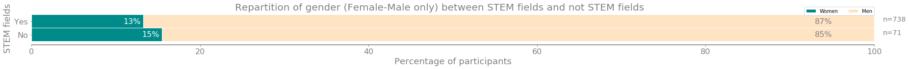
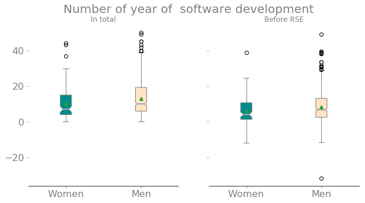

# Women and RSEs

## Introduction

This year, since 2016, we run a survey to investigate several aspects of the composition of the Research Software Engineers (RSEs), as well as their opinion on their work.
The survey has not been specifically designed to study gender disparities, however it is possible to study some aspect of gender composition and see if the RSE community is inclusive.
One important aspect reported in the previous year was the gender disparities (Link to WSSSPE paper).
We wanted to see if it is still the case and analysing some details about it.
This blogpost is about the difference between men and women in the composition of the RSE cohort.
It also investigates the origin of the difference prior to the entry as RSE ^[The code used to produced the tables and the plots can be found on the github repository of the survey, under the [blogpost branch]()].

### Details on the survey

This year, we had answers from a total of 32 countries. Among them, 7 countries actively participated to the creation of the survey and have a significant higher number of participants; Australia (n=99), Germany (n=333), Netherlands (n=54), New Zealand (n=37), United Kingdom (n=237), United States (n=147) and South Africa (n=23).
Therefore, every countries that were not from that active collaborators have been collapsed under the category `World`.
This category contains all the following countries; Czech Republic (n=6), Norway (n=6), France (n=5), Spain (n=4), Italy (n=4), Brazil (n=3), Denmark (n=3), Belgium (n=3), Switzerland (n=2), Botswana (n=2), Sweden (n=2), Ireland (n=2), Ethiopia (n=1), Portugal (n=1), Poland (n=1), Russian Federation (n=1) Benin (n=1), Greece (n=1), India (n=1), Turkey (n=1), Nigeria (n=1), Malawi (n=1), Japan (n=1), Saudi Arabia (n=1), Mauritius (n=1).

In total we collected 985 answers and after filtering out the non answer and the people that are not RSE, the total of participants analysed is 984.

For more details about the composition of the survey and the filtering process please refer to the specific [jupyter notebook](https://github.com/softwaresaved/international-survey/blob/master/analysis/2018/1.%20Overview%20and%20sampling.ipynb) shared on the github.

### Gender question
The participants were asked about their gender with the following possible answers (plus the possibility to not answer the question):
 * `Women`
 * `Men`
 * `Other`
 * `Prefer not to say`

As shown in the Table 1 #tbl1, The total of participants who answered `women` is 109, while the total of men is 700.
31 participants preferred to not reveal their gender and 4 described themselves as `Other`.
The participants who choose `Prefer not to say` are recategorised as `No Answer` and are dropped from any further analysis. The participants who answered `Other` are very marginal in term of size.
This low number is problematic for comparing different groups.
A more appropriate qualitative approach is needed to draw any valuable outputs for that specific group, therefore they are dropped from the dataset.
After this last remove of participants, the present analysis is composed of 809 participants.

|     Country     | Women  | Men    | Other   | Prefer not to say |
|-----------------|--------|--------|---------|-------------------|
| Australia       | 12     | 69     | NaN     | 3                 |
| Germany         | 27     | 243    | NaN     | 11                |
| Netherlands     | 4      | 43     | NaN     | 2                 |
| New Zealand     | 3      | 31     | NaN     | NaN               |
| South Africa    | 2      | 17     | NaN     | NaN               |
| United Kingdom  | 29     | 162    | 1       | 11                |
| United States   | 29     | 98     | 3       | 4                 |
| World           | 3      | 37     | NaN     | NaN               |
| Total           | 109    | 700    | 4       | 31                |

Table 1: Participants per countries {#tbl1: participants_countries}

| Country          | Women                | Men                 |
| ---------------- | -------------------- | ------------------- |
| Australia        | 14.81                | 85.18               |
| Germany          | 10.0                 | 90.0                |
| Netherlands      | 8.51                 | 91.49               |
| New Zealand      | 8.82                 | 91.18               |
| South Africa     | 10.53                | 89.47               |
| United Kingdom   | 15.18                | 84.82               |
| United States    | 22.83                | 77.16               |
| World            | 7.5                  | 92.5                |
| Total            | 13.47                | 86.53               |

Table 2: Proportion of women and men per country {#tbl2: gender_country_perc}

In total, women account for just 13% (n=109) when only calculate with men (n=700) as shown in \ref{plot1} and in \ref{#tbl2}.
The United States are an expection, it is the only country with a percentage higher than 15%.

One could suppose that if there is a low percentage of women in RSE is due to an initial pool of candidates that is biased. The current gender disparities will be a direct consequence of pre-existing disparities, therefore RSEs process of hiring can be considered as equally fair toward men and women.

That form of argumentation is often used to explain difference in gender proportion. Here the added weight to it is the proof, as shown by HESA data, that there is a deficit of women in the potential candidates.

The following section try to develop this hypothesis and see if it can stand.
Obviously, it has to be interpreted carefully, the data at hand are not necessarily the most adequate to answer such question. There is no information about people that are not hired, neither the information about who apply for each RSE position. This data would probably be more indicated to see if there is an issue in the hiring process itself and if they are less women applying then men in general, as well as their direct difference in skills.

However, it is still possible to see interesting existing difference between women and men in the composition of the RSE cohort, and use the aforementioned hypothesis as a red string.

Specifically, this work will try if three arguments stand. The STEM argument (there is no women in STEM fields), the techie argument (no women code) and the old school argument (the existing difference is due to previous practices).

## The STEM argument
Historically, it was mainly the STEM fields that required (and created the role of) RSEs. People who know how to code and have an interest in a specific academic subject. Only lately software development has become ubiquitous among all fields.

The STEM fields have been well-known for their gender disparities.
For instance, the data provided by HESA in UK for the 2017/18 period can help to see that difference among STEM fields and other fields.

The data does not provide much granularity in the different fields, due to methodological constrains for HESA ^[The cost centre groups are different than the JACS code, as explained on the page: [https://www.hesa.ac.uk/support/definitions/staff#cost-centre-staff](https://www.hesa.ac.uk/support/definitions/staff#cost-centre-staff)]. However, it is possible to see where these fields are categorised, mainly in `Engineering & technology` and `Biological, mathematical & physical sicences`.

In `Engineering and technology` there is only 20% of women, while in `Biological, mathematical & physical sciences`, there is 35% of them. This shows a pre-existing bias in gender repartition, for UK at least. In other fields, some have over representation of women. This is the case for `Education` (50%), `Medicine, dentistery & health` (59%).

To get the same information, the survey asked the participants in which field they have obtained their highest diploma.
Unfortunately, the potential answers were specific to each countries.

To remediate to this problem, the different codes were converted into JACS code (the level 1 to be precise) ^[A detailed version of the JACS codes can be found here: [https://www.hesa.ac.uk/support/documentation/jacs/jacs3-detaile://www.hesa.ac.uk/support/documentation/jacs/jacs3-detailed](https://www.hesa.ac.uk/support/documentation/jacs/jacs3-detailed)] by matching each answer to the most adequate corresponding field. Therefore the following analysis does not reflect the true answer given by the participants.

After converting the diverse answers into the JACS codes, it is possible to see if RSEs are mainly hired from STEM fields.
Indeed, the data shows that the top 5 are all STEM fields, as expected:
* `Physical sciences`: accounts for 37%
* `Computer science`: accounts for 25%
* `Biological sciences`: accounts for 12%
* `Engineering`: accounts for 11%
* `Mathematics`: accounts for 8%

Up to 93% of the RSEs have studied in one of these STEM fields.
Consequently if the RSEs are mainly from these fields, we can argue that the low percentage of women in RSE is due to the bias in the original pool.

As we could have expected  there is a lower percentage of women from STEM fields. But not only in STEM fields.
The percentage of women from other fields is also low.

To illustrate the point it is possible to recategorise the five top fields into a `STEM field` and the remaining fields into a `Not STEM field`. In this way, if the argument of less women in RSE is due to less women in STEM fields, that difference should only show for the STEM fields.

As shown in the figure XXXX, this is not the case, the difference is exactly the same for our sample set. There is the same low percentage of women in STEM field (13%), than for the non STEM fields (15%).

The bias in the academic field may partially explained by the high number of RSE coming from STEM, associated to the existing bias in the STEM field.
However, when we take a look at the non-STEM fields, the bias remain presents.
In that case, it is not possible to explain the difference by the lack of women in STEM.
An alternative explanation could be in the *techie* aspect of the role of RSE.
The following section decompose that hypothesis with the data at hand.

## The techie argument

Again, the survey was not designed to investigate why women are not entering the career as RSE, but it is still possible to get some insights.

One argument heard about the low presence of women in RSE, alongside of the STEM ones, is that even if there is a multidisciplinary aspect to the role, it is still mainly software development. As such, the issue remains the same, way less women code than men.

During the survey, the participants were asked how many years of software development they had.
The purpose was to give information about the experience in coding.
Another question asked them when they did start their contract.
By combining the answers of these two unrelated questions it is possible to have information about how much software development they had **prior** to be hired as RSE.
From there it is possible to know if people were hired without prior experience.

In other words, it is possible to see if the RSEs hired have previous experience in coding

According to the data, mean of year of development is significantly  (twosample t-test, p < 0.022) lower for women (n=96, mean=6.53 years) than for men (n=632, mean=8.55 years).

Substracting the number of years of experience with the number of years since hired as RSE a score could be created to know if the participant was hired with or without prior coding experience.

| Gender | No prior coding experience | Prior coding experience | Percentage of no prior coding experience |
| ------ | -------------------------- | ----------------------- | --                                       |
| Female | 16                         | 93                      | 15%                                |
| Male   | 58                         | 642                     | 8%                                |

By gender, there is a higher proportion of women hired without prior softwared development skills. However, in raw numbers, there are more men hired without prior softwared development skills than women.

## The old school argument

Lastly, it is possible to hope that the existing difference is a consequence of the past. It may be possible to see if there is a shift in the hiring process.
To see the difference overtime, the question about the start of the contract is used again. A plot of the percentage of women hired over time can be found in the plotXXX.

As shown, there is no difference overtime on the percentage of hiring women. Moreover, in 2014 no women were hired despite having 29 new RSEs. In 2017, among the 139 new RSEs, only 11 were women.
The plot shows that regardless of the number of RSEs hired, the women percentage remains the same, but it is translated into a bigger gap overtime. In 2018, 149 men were hired, while only 31 women were hired. It is a net difference of 118 persons.

## Conclusion and limits

There is a real issue on gender balance in RSE. That difference changes from country to country but overall the low percentage of women in our panel (13%) is a lower number than what is usually found in the academic world.
RSEs appear to be in a really bad state compare to the general picture of gender parity in UK research.
It is hard to figure out why RSEs attract so few women and it is hard to get a clear answer. Then one question asked was if the origin of the imbalance could be found in the ADN of the RSE role.
A RSE is mainly a STEM academic that has software developing skills. Both of these aspects are well-known to be inbalanced.

Therefore the problem do not specifically layed into the recruiters hands, but it is only the translation of a pre-existing problem, living outside the reach of the community.
The problem faced could origin in the poor pool of potential candidates. The existing imbalance in STEM fields permanently biased the gender parity in RSE, the *techie*/*suport* aspect of it, or a past bias that. However, as seen, the survey presents data to support some counter arguments to this idea.

First, even if the vast majority of RSEs are coming from the STEM fields, the percentage of women that comes from them is still much lower than the percentage of existing women in that field. We could have expect a difference between men and women percentage, but not necessarily a bigger gap. Still about the fields, if the argument of original bias in academic fields was sustainable, it would have a reverse tendency for non-bias fields such as medecine. It is not the case either, women are still vastly under represented in RSEs even coming from these fields.

Second, the argument that RSE is a `techie` role, which also suffer from gender disparities. Despite the RSE being fundamentally multidisciplinary role, the software development remains the central activity of them ^[See [https://github.com/softwaresaved/international-survey/blob/master/analysis/2018/b.%20Current%20employment.ipynb](https://github.com/softwaresaved/international-survey/blob/master/analysis/2018/b.%20Current%20employment.ipynb) for detailed analysis on that aspect] .
Therefore, the RSEs will be hired among people that have coding capabilities and these specific group has it is own limitations.

Lastly, we could argue that the current disparities are the result of previous issues in hiring. In other words, the current RSEs were hired long time ago and the gender gap will take time to be resolved.
Unfortunately, it is not the case. When analysing when the participants were hired the percentage of women remains stable, regardless of the number of hired RSEs. Not only this remain stable, but even with the massive increase of hired RSE that started in 2014, that year, no hired participants were women.

Of course, this analysis has its limits. Beside the already mentioned issue about the type of data at hand compared to a dataset about CV of people that have applied for an RSE position, it is still possible to mention a couple more.

The data analysis is done on the worldwide data, without distinction between countries, while the data shown difference of proportion among them.
For instance, US has the highest proportion of women (25%).
The different analysis would have been more interesting if conducted per countries but the low number of women in the sample did not allow for that.
However, even by taking each countries individually, to  if we could find some specific country context that can explain some difference, it remains a largely shared issues.

On the job hiring information, the measure is on second order. The participants may have been working as RSE prior to their current contract, therefore it will not necessarily reflect the situation for RSE, but for their current job as RSE. It could change the information about the non-prior experience in software development and increase the number of participants without coding experience before being hired as RSE.
However, even if this hypothesis could be verified, it will only strength the argument that `techie` unbalanced does not stand as more people without prior software development experience can still be hired, extending the pool to other potential candidates.

An alternative explanation could also be given. If there is more women with less or no prior software development than men, it shows an effort to hire more women despite not being *as good* as men.
This argumentation requires a twist to consider that people without prior software development are not as good at the others.

However, on the total count, more men than women without prior experience are hired, meaning that even if the first part of this (bad) argumentation holds (hiring incompetent people), it is impossible to confirm the second part (hiring incompetent people to get more women). At equal potential incompetencies, more men are hired than women.

It is possible to conclude, bearing the limitations, the existence of an inherent bias against women in RSE that could not entirely being explained by pre-existing bias in the availability of potential candidates.
